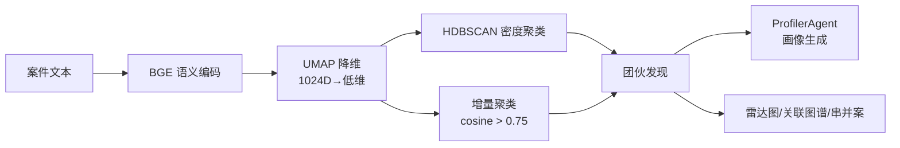

<p align="center">
  <h1 align="center">🔍 FraudLens — 多智能体协同反欺诈智能研判系统</h1>
  <p align="center">
    <em>面向公安机关反诈中心的全流程 AI 智能研判平台</em>
  </p>
</p>

<p align="center">
  
  
  
  
  
  
  
  
</p>

---

## 📖 项目背景

当前反诈中心每日接收大量涉诈线索，面临三大痛点：

- **人工逐条研判效率低** — 案件量大，纯人工分析耗时长
- **串并案依赖经验易遗漏** — 不同民警判断标准不一，关联案件容易遗漏
- **话术翻新快规则匹配覆盖窄** — 基于关键词规则的匹配方法难以应对新型变种

本项目以中国人民公安大学《融合大语言模型和语义聚类的电信网络诈骗引流话术文本分析》论文为理论基座，将语义聚类方法从单一的话术分类扩展为覆盖全链路的智能研判流程，构建面向实战的 AI 反诈研判系统。

---

## 🎯 系统定位

FraudLens 定位为反诈中心民警的**智能辅助研判工具**，核心能力包括：

- **多源数据接入**：支持文本直接录入、文件批量上传和 OCR 图片识别三种方式
- **自动化研判流水线**：6 个智能体协同完成研判全流程，将数小时的人工研判压缩至分钟级
- **双路径串并案推荐**：语义聚类 + Jaccard 实体重叠两条路径互补，减少遗漏
- **可靠性保障**：基于客观指标的置信度评估，低置信度标记建议人工复核

---

## 🏗️ 系统架构

```
                    ┌──────────────────────────────────────┐
                    │          Nginx (:80)                  │
                    │   静态文件 + API反向代理 + WebSocket    │
                    └──────────┬───────────────────────────┘
                               │
              ┌────────────────┼────────────────┐
              ▼                ▼                ▼
     ┌───────────────┐ ┌──────────────┐ ┌──────────────┐
     │  交互层       │ │  决策与协同层 │ │  数据与模型层 │
     │  Vue 3 SPA    │ │  FastAPI     │ │  MySQL 8.0   │
     │  Element Plus │ │  ChiefAgent  │ │  Redis 7     │
     │  ECharts      │ │  6 Agent流水线│ │  BGE 本地模型 │
     │  vis-network  │ │  BGE→UMAP    │ │  DeepSeek API│
     │               │ │  →HDBSCAN    │ │  EasyOCR     │
     └───────────────┘ └──────────────┘ └──────────────┘
```

### 三层架构

| 层级 | 技术组件 | 职责 |
|------|---------|------|
| **交互层** | Vue 3 + Element Plus + ECharts + vis-network | 数据看板、团伙雷达图、关联网络图谱、资金流向图 |
| **决策与协同层** | FastAPI + ChiefAgent + 6 Agent | 阶段调度、智能研判、异常回退、置信度评估 |
| **数据与模型层** | MySQL + Redis + BGE + DeepSeek + EasyOCR | 数据持久化、缓存加速、语义编码、LLM分析、OCR识别 |

### 核心算法流程



---

## 🤖 6阶段智能体流水线

系统采用多 Agent 流水线架构，ChiefAgent 作为中枢编排器协调 6 个专业 Agent：

| 阶段 | Agent | 功能 | 输入→输出 |
|------|-------|------|-----------|
| 1 | **PreprocessAgent** | 数据清洗、敏感信息脱敏、质量评分 | 原始线索 → 标准化数据 |
| 2 | **TriageAgent** | 诈骗类型分类、紧急程度判定 | 标准化数据 → 结构化分案结果 |
| 3 | **AnalystAgent** | 关键实体提取、话术特征分析、角色分离 | 分案结果 → 深度分析报告 |
| 4 | **ClusterAgent** | BGE编码→UMAP降维→HDBSCAN聚类→团伙发现 | 分析报告 → 聚类结果 |
| 5 | **ProfilerAgent** | 团伙画像生成、雷达图维度评估、威胁评级 | 聚类结果 → 团伙画像 |
| 6 | **汇总模块** | 报告生成、可视化输出 | 全部结果 → 研判报告 |

### 关键技术特性

- **BGE-large-zh-v1.5 本地推理**：1024维语义向量编码，数据不出域，符合公安安全要求
- **UMAP 降维**：保留局部和全局流形结构，为密度聚类提供高质量输入
- **HDBSCAN 密度聚类**：无需预设簇数量，自动发现任意形状的簇并识别噪声点
- **增量聚类**：余弦相似度阈值 0.75，新案件自动归入已有簇或创建新簇，无需全量重算
- **聚类质量评估**：Silhouette 轮廓系数 + Davies-Bouldin 指数双指标评估

### 串并案推荐双路径

```
路径一：语义聚类 ── 基于话术向量相似度 → 发现使用相同话术模板的团伙
路径二：Jaccard  ── 基于实体重叠系数   → 发现共享作案资源的关联
```

两条路径结果合并去重后输出，语义聚类能发现实体未暴露的关联，实体比对能发现话术不同但共享作案工具的关联，最大限度减少遗漏。

### 三层可靠性保障

1. **置信度评估层**：基于分类概率集中度、实体提取完整度、聚类质量指标等客观维度计算，不依赖 LLM 自评
2. **异常回退层**：LLM 调用失败 → 规则引擎兜底；聚类失败 → 规则分组；保障系统可用
3. **人工复核层**：低置信度标记"建议人工复核"，民警确认/修正后反馈至后续流程

---

## 🛠️ 技术栈

| 类别 | 技术 | 用途 |
|------|------|------|
| **后端框架** | FastAPI + uvicorn | ASGI 高性能 Web 框架 |
| **前端框架** | Vue 3 + Element Plus | 响应式 SPA 界面 |
| **大语言模型** | DeepSeek Chat | 智能分案、案件深度分析 |
| **语义编码** | BAAI bge-large-zh-v1.5 | 1024维语义向量编码 |
| **聚类算法** | UMAP + HDBSCAN | 团伙自动发现 |
| **OCR 识别** | EasyOCR | 图片/截图文字提取 |
| **视觉分析** | DeepSeek VL2 | 多模态内容识别 |
| **数据库** | MySQL 8.0 + SQLAlchemy 2.0 | 14张关系型数据表 |
| **缓存/队列** | Redis 7 | 令牌黑名单、预警缓存、进度推送 |
| **认证** | PyJWT 双令牌 | Access Token + Refresh Token |
| **可视化** | ECharts + vis-network | 雷达图、关联图谱、资金流向图 |
| **实时通讯** | WebSocket | 分析进度实时推送 |
| **容器化** | Docker + Docker Compose | 5服务一键部署 |

---

## 📋 功能模块

| 模块 | 说明 |
|------|------|
| **数据看板** | ECharts 统计图表 + 关键指标卡片，展示态势总览 |
| **智能研判** | 6阶段 Agent 流水线，一键启动自动分析 |
| **案件管理** | 完整 CRUD + 状态流转（待分析→已分析→已立案→侦办中→已结案） |
| **团伙发现** | BGE 语义编码 → UMAP 降维 → HDBSCAN 密度聚类 |
| **团伙画像** | 雷达图 6 维特征评估 + 威胁评级 + 作案手法描述 |
| **资金流向追踪** | 多层资金链路可视化，自动标注洗钱路径 |
| **关联图谱** | vis-network 交互式力导向图谱，搜索高亮/筛选 |
| **串并案推荐** | 语义聚类 + Jaccard 实体重叠双路径互补 |
| **预警监控** | 新案件自动比对历史数据，命中实体即时预警 |
| **派单管理** | 案件派单→签收→处置→反馈全流程 |
| **重点人员** | 前科人员/高危人员/涉诈重点人/两卡人员管理 |
| **报告导出** | PDF/Word 格式案件报告 + 团伙画像报告 |
| **批量导入** | CSV/Excel 批量导入 + OCR 图片识别 + 文件智能解析 |
| **系统管理** | 用户管理 + 操作审计日志 + AI 配置在线设置 |
| **分析会话** | 跟踪每次分析进度，支持历史回溯 |

---

## 🚀 快速开始

### Docker 一键部署（推荐）

**前置条件：** Docker Desktop 已安装并运行

```bash
# 1. 克隆项目
git clone https://github.com/winterhdsec-cmd/FraudLens.git
cd FraudLens

# 2. 配置环境变量
cp .env.docker .env
# 编辑 .env 填入 DeepSeek API Key:
# DEEPSEEK_API_KEY=sk-你的API密钥

# 3. 一键启动
docker-compose up -d --build

# 4. 访问系统
# 🌐 http://localhost
# 👤 admin / admin123
```

**下载 BGE 模型（可选，用于团伙聚类）：**
```bash
# 从 HuggingFace 下载 bge-large-zh-v1.5
# 放置到 backend/bge-large-zh-v1.5/
# 然后复制到容器
docker cp backend/bge-large-zh-v1.5/. $(docker-compose ps -q backend):/app/bge-large-zh-v1.5/
docker-compose restart backend
```

> ⚠️ 不下载 BGE 模型不影响其他功能，仅团伙聚类分析不可用

### 本地开发

```bash
# 后端
cd backend
pip install -r requirements.txt
# 创建 key.env 配置数据库和 API Key
python main.py

# 前端
cd frontend
npm install
npm run dev

# 访问：前端 http://localhost:5173，后端 http://localhost:5003
```

---

## 🗄️ 数据库设计

系统共 14 张数据表：

| 表名 | 说明 |
|------|------|
| `users` | 用户/权限 |
| `operation_logs` | 操作审计日志 |
| `analysis_sessions` | 分析会话 |
| `cases` | 诈骗案件 |
| `gangs` | 犯罪团伙 |
| `gang_case_relations` | 团伙-案件关联 |
| `persons` | 人员信息 |
| `accounts` | 银行账户 |
| `phones` | 电话号码 |
| `evidence_items` | 证据材料 |
| `alert_records` | 预警记录 |
| `merge_suggestions` | 串并案建议 |
| `capital_flows` | 资金流向 |
| `dispatch_orders` | 派单记录 |
| `key_persons` | 重点人员 |

---

## 🐳 Docker 架构

docker-compose.yml 编排 5 个服务：

| 服务 | 镜像 | 端口 | 职责 |
|------|------|------|------|
| **nginx** | nginx:alpine | :80 | 反向代理 /api/* → backend:5003，静态文件 → Vue SPA |
| **backend** | Python 3.11 | :5003 | FastAPI + BGE + OCR + DeepSeek |
| **mysql** | mysql:8.0 | :3306→宿主机:3307 | 14张数据表持久化 |
| **redis** | redis:7-alpine | :6379→宿主机:6380 | 缓存/黑名单/进度推送 |
| **seed** | Python 3.11 (一次性) | — | 注入 75 条演示案件数据 |

---

## 📜 项目成果

- 本项目已入围**院级科研项目**立项，获得学院科研基金支持
- 已入选**"创新湖北·青力青力"湖北省第十四届"挑战杯"大学生创业计划竞赛**

---

## 📁 项目结构

```
FraudLens/
├── backend/                        # 🖥️ 后端
│   ├── main.py                     # 应用入口 + 30+ API 路由
│   ├── agents/                     # 🤖 6大智能体
│   │   ├── chief_agent.py          # 中枢编排
│   │   ├── preprocess_agent.py     # 数据清洗/脱敏
│   │   ├── triage_agent.py         # 智能分案
│   │   ├── analyst_agent.py        # 案件深度分析
│   │   ├── cluster_agent.py        # 团伙发现
│   │   └── profiler_agent.py       # 团伙画像
│   ├── database/                   # 数据库模块
│   │   ├── models.py / p1_models.py # ORM 模型
│   │   ├── crud.py / dashboard.py  # CRUD + 统计
│   │   ├── importer.py             # 批量导入
│   │   ├── merge.py / alert.py     # 串并案/预警
│   │   └── report.py               # 报告导出
│   ├── routes/                     # API 路由
│   │   ├── auth.py                 # JWT 认证
│   │   ├── cases.py / gangs.py     # 案件/团伙
│   │   ├── alerts.py / merges.py   # 预警/串并案
│   │   ├── dashboard.py / reports.py# 看板/报告
│   │   ├── system.py               # 系统配置
│   │   └── files.py                # 文件上传
│   └── tools/                      # 工具模块
│       ├── engine.py               # BGE 编码引擎
│       ├── ocr.py / vision.py      # OCR/视觉
│       └── redis_utils.py          # Redis 工具
│
├── frontend/                       # 🌐 前端
│   └── src/
│       ├── views/                  # 11个页面组件
│       │   ├── DashboardView.vue   # 数据看板
│       │   ├── UploadView.vue      # 智能上传
│       │   ├── OverviewView.vue    # 案件总览
│       │   ├── CaseDetailView.vue  # 案件详情
│       │   ├── DetailsView.vue     # 团伙深度分析
│       │   ├── NetworkView.vue     # 关联图谱
│       │   ├── CapitalFlowView.vue # 资金流向
│       │   ├── AlertsView.vue      # 预警中心
│       │   ├── DispatchView.vue    # 派单管理
│       │   ├── ReportView.vue      # 报告中心
│       │   └── AdminView.vue       # 系统管理
│       ├── api.js                  # API 客户端
│       └── style.css               # 深色科技风主题
│
├── docker/                         # 🐳 Docker
│   ├── init.sql / data.sql         # 建表/演示数据
│   ├── entrypoint.sh / seed.sh     # 启动脚本
│   └── export-data.bat             # 数据导出
│
├── Dockerfile / docker-compose.yml # 容器编排
├── nginx.conf                      # Nginx 配置
└── .env.docker                     # 环境变量模板
```

---

## 📡 API 接口

| 方法 | 路径 | 说明 |
|------|------|------|
| POST | `/api/auth/login` | 用户登录 |
| POST | `/api/auth/register` | 用户注册 |
| GET/PUT | `/api/auth/me` | 用户信息/修改 |
| PUT | `/api/auth/change-password` | 修改密码 |
| GET | `/api/auth/logs` | 操作日志 |
| GET | `/api/auth/users` | 用户管理 |
| POST | `/agent-analyze` | 智能研判 |
| GET | `/api/dashboard` | 数据看板 |
| GET | `/api/dashboard/cases` | 案件趋势 |
| GET/PUT | `/api/cases` | 案件列表/查询 |
| GET/PUT | `/api/cases/{id}` | 案件详情/状态 |
| GET | `/api/cases/{id}/radar` | 案件雷达图 |
| GET | `/api/gangs` | 团伙列表 |
| GET | `/api/gangs/{id}` | 团伙详情 |
| GET | `/api/gangs/{id}/radar` | 团伙雷达图 |
| GET | `/api/alerts` | 预警列表 |
| POST | `/api/merges/suggest` | 串并案推荐 |
| GET | `/api/reports/case/{id}` | 案件报告(PDF) |
| GET | `/api/reports/gang/{id}` | 团伙报告(PDF) |
| POST | `/api/import/csv` | CSV导入 |
| POST | `/api/import/excel` | Excel导入 |
| POST | `/api/ocr` | OCR识别 |
| POST | `/api/analyze-file` | 文件分析 |
| POST | `/api/vision-analyze` | 视觉分析 |
| GET/PUT | `/api/settings/api-key` | AI配置 |
| GET | `/health` | 健康检查 |
| WS | `/ws/{session_id}` | 实时进度推送 |

---

## 📜 版本历史

| 版本 | 说明 |
|------|------|
| v1.0 | 基础框架：Flask + Vue + BGE 聚类 |
| v2.0 | 公安实战：JWT 认证 + 案件管理 + 串并案 + 报告导出 |
| v3.0 | 架构升级：FastAPI + DeepSeek LLM + WebSocket + 多Agent |
| v3.1 | Docker 部署 + vis-network 图谱 + AI 配置界面 + 资金追踪 |